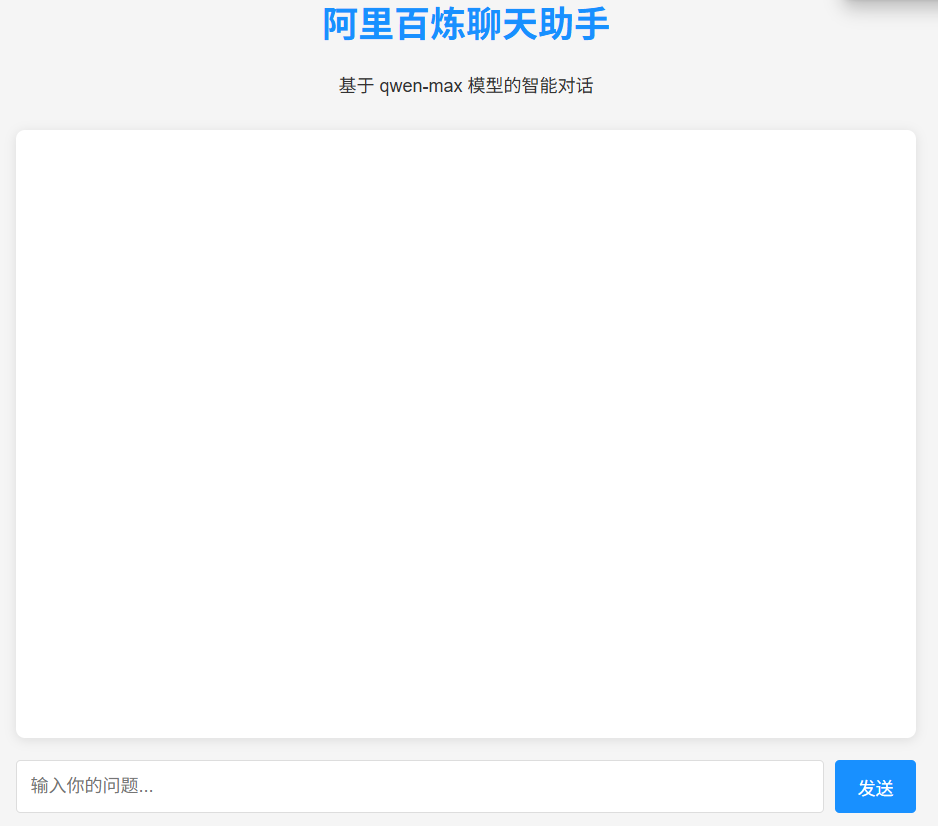

LLM Web UI 项目说明

项目概述

这是一个基于大型语言模型(LLM)的Web用户界面项目，包含多个Python脚本文件，用于与不同AI平台进行交互。

文件结构

web-ui/

├── Allama-deepseek.py      # 与Allama/Deepseek模型交互的脚本

├── API-Alibailian.py       # 与Alibailian API交互的脚本

├── API-PPIO.py             # 与PPIO API交互的脚本

功能说明

Allama-deepseek.py

• 实现与Allama或Deepseek语言模型的连接和交互

• 可能包含模型推理、参数设置等功能

API-Alibailian.py

• 提供与Alibailian API的接口

• 可能包含API调用、数据处理等功能

API-PPIO.py

• 实现与PPIO平台的API集成

使用说明

1. 克隆或下载本项目
2. 确保已安装Python 3.x环境
3. 安装所需依赖包
4. 根据需要运行相应脚本

依赖项

• Python 3.x

• requests (或其他HTTP客户端库)

• 其他特定API的SDK(请参考各脚本的具体要求)

注意事项

• 使用前请确保已获取各API平台的访问密钥

联系方式

如有任何问题或建议，请联系：qiaoyu_explorer@163.com
